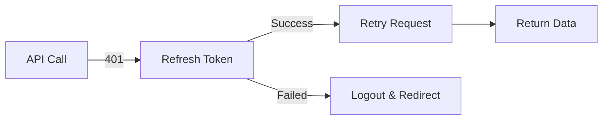

# 🚀 Quick Reference - Auto Refresh Token

## TL;DR

```typescript
// ✅ Đã implement - Không cần code gì thêm!
// Mọi API call qua RTK Query đều tự động refresh token

// Example - Tự động refresh khi cần
const { data } = useGetMeQuery();
const { data: jobs } = useGetJobsQuery();
// Nếu token hết hạn → auto refresh → retry → success!
```

## Key Points

### ✅ What's Implemented

| Feature              | Status | Details                                      |
| -------------------- | ------ | -------------------------------------------- |
| Auto token refresh   | ✅     | Khi 401, tự động gọi /auth/refresh           |
| Request retry        | ✅     | Retry request ban đầu với token mới          |
| Duplicate prevention | ✅     | Mutex ensures only 1 refresh call            |
| Auto logout          | ✅     | Redirect to /auth/login if refresh fails     |
| Token storage        | ✅     | localStorage for access, cookies for refresh |

### 🎯 How It Works



### 📝 Code Locations

```bash
# Main implementation
src/lib/redux/api.ts

# Documentation
REFRESH_TOKEN_FLOW.md
AUTO_REFRESH_IMPLEMENTATION.md

# Demo component (optional)
src/components/auth/auto-refresh-demo.tsx
```

### 🧪 Testing

```javascript
// Browser console
authTests.testConcurrentRequests(); // Test multiple requests
authTests.monitorRefreshCalls(); // Monitor refresh frequency
authTests.testMutexBehavior(); // Test mutex locking
```

### ⚙️ Configuration

```typescript
// No configuration needed!
// Works automatically with all RTK Query endpoints
```

### 🔍 Debugging

```javascript
// Check logs in console
// "Access token expired, attempting to refresh..."
// "Token refreshed successfully, retrying original request..."

// Check Network tab
// Should see only 1 /auth/refresh call
```

### 🚨 Troubleshooting

| Problem                | Solution                            |
| ---------------------- | ----------------------------------- |
| Still getting 401      | Check refresh token cookie exists   |
| Redirect loop          | Verify /auth/refresh endpoint works |
| Multiple refresh calls | Check mutex is properly imported    |
| Token not saved        | Check localStorage permissions      |

### 📊 Expected Behavior

#### Scenario 1: Token Expired

```
User → API Call → 401
     → Auto Refresh → Success
     → Retry Request → 200 OK
     → User gets data
```

#### Scenario 2: Refresh Failed

```
User → API Call → 401
     → Auto Refresh → Failed
     → Clear tokens
     → Redirect /auth/login
```

#### Scenario 3: Multiple Concurrent Requests

```
Request A, B, C → All get 401
     → Only 1 refresh call (Mutex)
     → New token saved
     → All 3 retry with new token
     → All 3 succeed
```

### 💡 Best Practices

✅ **DO:**

- Let the system handle token refresh automatically
- Check Network tab to verify single refresh calls
- Use demo component for testing

❌ **DON'T:**

- Manually refresh tokens in components
- Store refresh token in localStorage
- Implement custom retry logic

### 🎨 Integration Examples

```typescript
// ✅ Already works - no changes needed!
function UserProfile() {
  const { data, isLoading } = useGetMeQuery();
  // Token refresh handled automatically

  if (isLoading) return <Spinner />;
  return <div>{data.name}</div>;
}

// ✅ Multiple queries - all protected
function Dashboard() {
  const { data: user } = useGetMeQuery();
  const { data: jobs } = useGetJobsQuery();
  const { data: resumes } = useGetResumesQuery();
  // All 3 share the same refresh token logic
}
```

### 🔐 Security Checklist

- ✅ Access token in localStorage (short-lived)
- ✅ Refresh token in httpOnly cookie (secure)
- ✅ Auto logout on refresh failure
- ✅ No token in URL or session storage
- ✅ HTTPS only in production

### 📈 Performance Metrics

```
Before: 5 requests × 401 = 5 refresh calls
After:  5 requests × 401 = 1 refresh call

Network savings: 80%
User experience: Seamless
Implementation complexity: Low
```

### 🎯 Quick Verification

```bash
# 1. Login to app
# 2. Open DevTools → Network tab
# 3. Clear access_token from localStorage
# 4. Make any API call
# 5. Verify:
#    - 1 call to /auth/refresh
#    - Original request retried with new token
#    - Both succeed
```

### 📚 Further Reading

- `REFRESH_TOKEN_FLOW.md` - Detailed flow diagram
- `AUTO_REFRESH_IMPLEMENTATION.md` - Full documentation
- `src/lib/redux/api.ts` - Source code

---

**Status**: ✅ Production Ready  
**Maintenance**: Zero - works automatically  
**Dependencies**: async-mutex (already installed)
